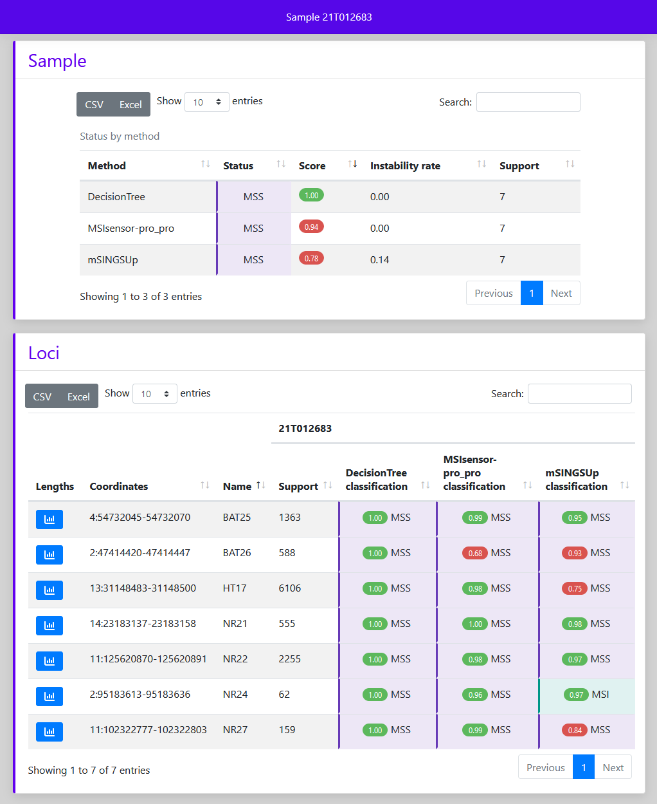

# MInITI: Microsatellites INstability from hIgh Throughput sequencIng

## Table of Contents
* [Description](#description)
* [Workflows steps](#workflows-steps)
* [Installation](#installation)
* [Usage](#usage)
* [Performances](#performances)
* [Copyright](#copyright)
* [Contact](#contact)

## Description
This workflow classify microsatellites instability from high througput
sequencing on Illumina's instruments.

Sample classification is based on comparison with a learning model creating from
a panel of stable and unstable. As consequence, it does not need a normal tissue
for evaluated sample and the application come with two workflows: learn and tag.

`Learn` produces the learning model from a list of samples, their known classification and the list of MSI targets. It must be run on data coming from your laboratory process and the resulting model should be used to classify data generated using the same protocols.

`Tag` classifies loci and samples, produces confidence score for these classifications and writes an interactive report.

## Workflows steps
### 1. MInITI learn
<figure>
    
    <figcaption align = "center"><b>Fig.1 - Learn steps</b></figcaption>
</figure>

The `learn` workflow produces the learning model from a list of samples, their known classification and the list of MSI targets. It can be run only once for your panel. The model created will be one of the input of all run of the MInITI tag on the same panel with the same laboratory protocol.

Workflow (see Fig.1):
* If you start from the FastQ, firsts steps are the alignment of reads and the duplicates marking.
* Then, the distribution of reads lengths for each locus is retrieve.
* Finally, features will be used in classifiers decision (MInITI tag) are calculated. Lengths distributions, classifiers features and status of each loci are then stored in the model file.

### 2. MInITI tag
<figure>
    
    <figcaption align = "center"><b>Fig.2 - Tag steps</b></figcaption>
</figure>

The `tag` workflow classifies loci and samples, produces confidence score for these classifications and writes an interactive report.

Workflow (see Fig.2):
* If you start from the FastQ, firsts steps are the alignment of reads and the duplicates marking.
* Then, the distribution of reads lengths for each locus is retrieve.
* This distribution is used by three independant classifiers to tag loci by comparison to model. Then the sample class is inferred by instability ratio on these loci. The classifiers used on loci are:
 * An [mSINGS](https://bitbucket.org/uwlabmed/msings/src/master/) reimplementation,
 * An [MSISensor-pro](https://github.com/xjtu-omics/msisensor-pro) pro algorithm's reimplementation,
 * A classifier from [sklearn](https://scikit-learn.org/stable/) (default: random forest)
* Finally, results from all classifiers are merged and a report is produced.

## Installation
### 1. Download code
Use one of the following:

* [user way] Downloads the latest released versions from
`https://github.com/bialimed/miniti/archive/releases`.
* [developper way] Clones the repository from the latest unreleased version:

      git clone --recurse-submodules git@github.com:bialimed/miniti.git

### 2. Install dependencies
* conda (>=4.6.8):

      # Install conda
      wget https://repo.anaconda.com/miniconda/Miniconda3-latest-Linux-x86_64.sh && \
      sh Miniconda3-latest-Linux-x86_64.sh

      # Install mamba
      conda activate base
      conda install -c conda-forge mamba

  More details on miniconda install [here](https://docs.conda.io/en/latest/miniconda.html).

* snakemake (>=5.4.2):

      mamba create -c conda-forge -c bioconda -n miniti snakemake
      conda activate miniti
      pip install drmaa

  More details on snakemake install [here](https://snakemake.readthedocs.io/en/stable/getting_started/installation.html).

* Install rules dependencies (cutadapt, bwa, ...):

      conda activate miniti
      snakemake \
        --use-conda \
        --conda-prefix ${application_env_dir} \
        --conda-create-envs-only
        --snakefile ${APP_DIR}/Snakefile_learn \
        --configfile workflow_parameters.yml

### 3. Test install
* From `${APP_DIR}/test/config/wf_config.yml` set variables corresponding to
databanks (see `## ${BANK}/... ##`).

* Launch test with following command:

      conda activate miniti
      ${APP_DIR}/test/launch_wf.sh \
        ${CONDA_ENVS_DIR} \
        ${WORK_DIR} \
        ${DRMAA_PARAMS}

  Example with scheduler slurm:

      export DRMAA_LIBRARY_PATH=$SGE_ROOT/lib/linux-rhel7-x64/libdrmaa.so

      conda activate miniti
      ~/soft/sofur/test/launch_wf.sh \
        /work/$USER/conda_envs/envs \
        /work/$USER/test_sofur \
        ' --partition={cluster.queue} --mem={cluster.mem} --cpus-per-task={cluster.threads}'

* See results in `${WORK_DIR}/report/run.html`.

## Usage
### 1. MInITI learn
#### Configuration
...................................................

#### launch command
    conda activate miniti
    snakemake \
      --use-conda \
      --conda-prefix ${application_env_dir} \
      --jobs ${nb_jobs} \
      --jobname "miniti.{rule}.{jobid}" \
      --latency-wait 100 \
      --snakefile ${application_dir}/Snakefile_learn \
      --cluster-config ${application_dir}/config/cluster.json \
      --configfile workflow_parameters.yml \
      --directory ${out_dir} \
      > ${out_dir}/wf_log.txt \
      2> ${out_dir}/wf_stderr.txt

#### Output directory
...................................................

### 2. MInITI tag
#### Configuration
Copy `${APP_DIR}/config/workflow_parameters.tpl.yml` in your current directory
and change values before launching. ....................................................

#### launch command
    conda activate miniti
    snakemake \
      --use-conda \
      --conda-prefix ${application_env_dir} \
      --jobs ${nb_jobs} \
      --jobname "miniti.{rule}.{jobid}" \
      --latency-wait 100 \
      --snakefile ${application_dir}/Snakefile_tag \
      --cluster-config ${application_dir}/config/cluster.json \
      --configfile workflow_parameters.yml \
      --directory ${out_dir} \
      > ${out_dir}/wf_log.txt \
      2> ${out_dir}/wf_stderr.txt

#### Output directory
The main elements of the output directory are the following:

    out_dir/
    ├── ...
    └── report/
        ├── data/
        |   └── sample-A_stabilityStatus.json
        ├── ...
        ├── run.html
        └── sample-A.html

`${out_dir}/report/data/${sample}_stabilityStatus.json` contains classification
information about sample in computer readable format defined by
[AnaCore](https://github.com/bialimed/AnaCore) library.

`${out_dir}/report/${sample}.html` (see Fig.3) is an interactive report
to inspect:
 * Sample classification and confidence score from all classifiers.
 * Loci sequencing depths, distribution lengths profile (see Fig.4), classifications and
 confidence score from all classifiers.
doc/img/example_res.png

<figure>
    
    <figcaption align = "center"><b>Fig.3 - Sample report</b></figcaption>
</figure>
<figure>
    
    <figcaption align = "center"><b>Fig.4 - Lengths distribution panel</b></figcaption>
</figure>

## Performances
Performance was evaluated on a dataset from 160 colorectal cancer patients.
Samples were sequenced with a targeted panel (mutation hotspots and MSI) from
FFPE block. The results summarized in [assessment/report.html](assessment/report.html).
Commands and configurations used in evaluation process can be found in
`assessment` folder.

## Copyright
2022 Laboratoire d'Anatomo-Cytopathologie de l'Institut Universitaire du Cancer
Toulouse - Oncopole

## Contact
escudie.frederic@iuct-oncopole.fr
