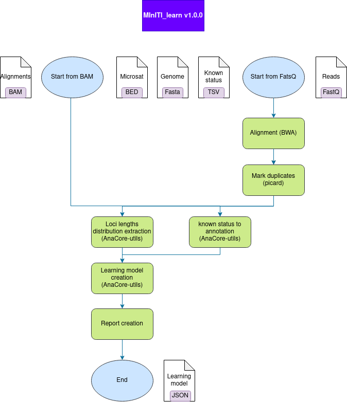
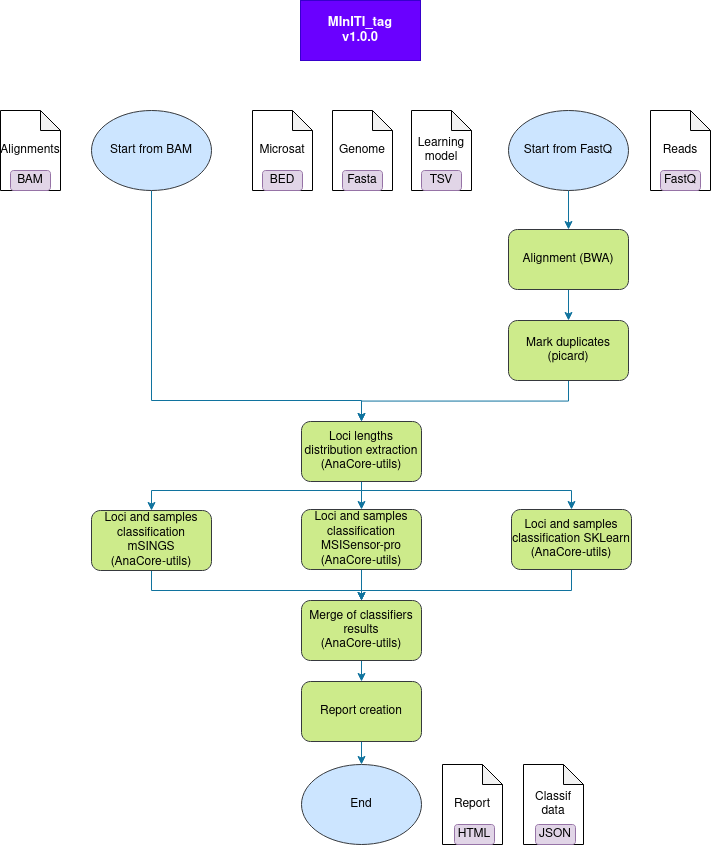
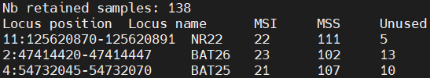
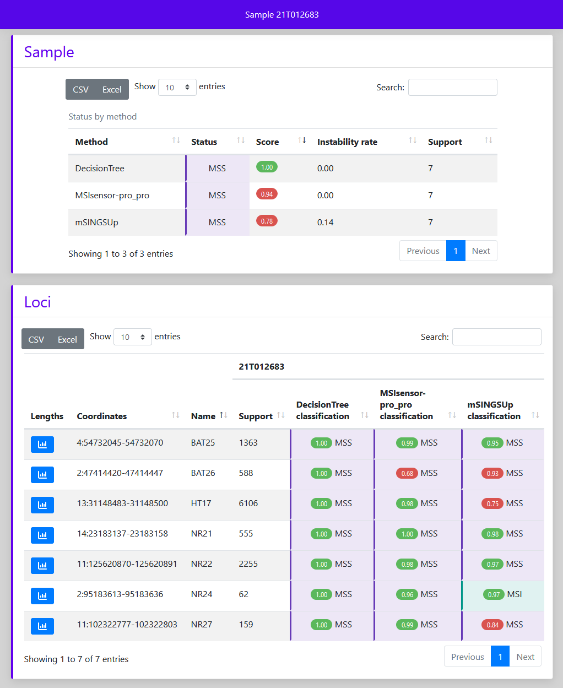
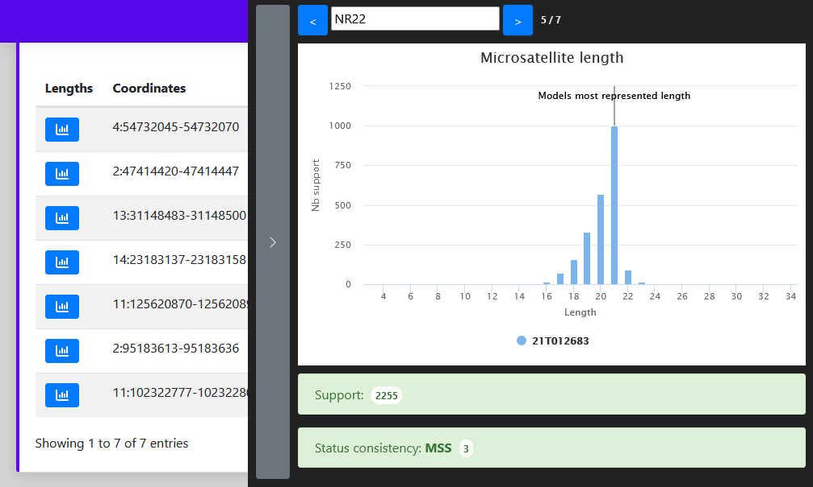

# MInITI: Microsatellites INstability from hIgh Throughput sequencIng

## Table of Contents
* [Description](#description)
* [Workflows steps](#workflows-steps)
* [Installation](#installation)
* [Usage](#usage)
* [Performances](#performances)
* [Copyright](#copyright)

## Description
This workflow classify microsatellites instability from high throughput
sequencing on Illumina's instruments.

Sample classification is based on comparison with a learning model creating from
a panel of stable and unstable. As consequence, it does not need a normal tissue
for evaluated sample and the application come with two workflows: learn and tag.

`Learn` produces the learning model from a list of samples, their known
classification and the list of MSI targets. It must be run on data coming from
your laboratory process and the resulting model should be used to classify data
generated using the same protocols.

`Tag` classifies loci and samples, produces confidence score for these
classifications and writes an interactive report.

## Workflows steps
### 1. MInITI learn
<figure>
    
    <figcaption align = "center"><b>Fig.1 - Learn steps</b></figcaption>
</figure>

The `learn` workflow produces the learning model from a list of samples, their
known classification and the list of MSI targets. It can be run only once for
your panel. The model created will be one of the input of all run of the MInITI
tag on the same panel with the same laboratory protocol.

Workflow (see Fig.1):
* If you start from the FastQ, firsts steps are the alignment of reads and the
duplicates marking.
* Then, the distribution of reads lengths for each locus is retrieve.
* Finally, features will be used in classifiers decision (MInITI tag) are
calculated. Lengths distributions, classifiers features and status of each loci
are then stored in the model file.

### 2. MInITI tag
<figure>
    
    <figcaption align = "center"><b>Fig.2 - Tag steps</b></figcaption>
</figure>

The `tag` workflow classifies loci and samples, produces confidence score for
these classifications and writes an interactive report.

Workflow (see Fig.2):
* If you start from the FastQ, firsts steps are the alignment of reads and the
duplicates marking.
* Then, the distribution of reads lengths for each locus is retrieve.
* This distribution is used by three independant classifiers to tag loci by
comparison to model. Then the sample class is inferred by instability ratio on
these loci. The classifiers used on loci are:
 * An [mSINGS](https://bitbucket.org/uwlabmed/msings/src/master/) reimplementation,
 * An [MSISensor-pro](https://github.com/xjtu-omics/msisensor-pro) pro algorithm's
 reimplementation,
 * A classifier from [sklearn](https://scikit-learn.org/stable/) (default: random
 forest)
* Finally, results from all classifiers are merged and a report is produced.

## Installation
### 1. Download code
Use one of the following:

* [user way] Downloads the latest released versions from
`https://github.com/bialimed/miniti/archive/releases`.
* [developper way] Clones the repository from the latest unreleased version:

      git clone --recurse-submodules git@github.com:bialimed/miniti.git

### 2. Install dependencies
* conda (>=4.6.8):

      # Install conda
      wget https://repo.anaconda.com/miniconda/Miniconda3-latest-Linux-x86_64.sh && \
      sh Miniconda3-latest-Linux-x86_64.sh

      # Install mamba
      conda activate base
      conda install -c conda-forge mamba

  More details on miniconda install [here](https://docs.conda.io/en/latest/miniconda.html).

* snakemake (>=5.4.2):

      mamba create -c conda-forge -c bioconda -n miniti snakemake==6.15.0

  More details on snakemake install [here](https://snakemake.readthedocs.io/en/stable/getting_started/installation.html).

* In folder `${APP_DIR}/test/config` set variable corresponding to genome
(`##${GENOME_HG38}##`) in `wf_learn_config.yml` and `wf_tag_config.yml`.

* Install rules dependencies (bwa, picard, ...):

      conda activate miniti
      cd ${APP_DIR}/test
      snakemake \
        --cores 1 \
        --use-conda \
        --conda-prefix ${application_env_dir} \
        --conda-create-envs-only
        --snakefile ${APP_DIR}/Snakefile_learn \
        --configfile config/wf_learn_config.yml

### 3. Test install
* Launch test with following command:

      conda activate miniti
      ${APP_DIR}/test/launch_wf.sh \
        ${CONDA_ENVS_DIR} \
        ${WORK_DIR} \
        ${CLUSTER_PARAMS}

  Example with scheduler slurm:

      conda activate miniti
      ~/soft/miniti/test/launch_wf.sh \
        /work/$USER/conda_envs/envs \
        /work/$USER/test_miniti \
        'sbatch --partition={resources.partition} --mem={resources.mem} --cpus-per-task={threads}'

* See results in `${WORK_DIR}/tag/report/run.html`.

## Usage
### 1. MInITI learn
#### Important considerations

Number of Samples for model creation: To provide an accuracy compatible with
medical process it is necessary to capture all the diversity on your data for
each class. A large number of samples in each class can easily this goal and
reduce bias. If only a small number of samples are available, at least 30 stable
and 30 unstable samples per locus should be a minimum to create the model on one
pathology.

Status per loci: MInITI classifies each microsatellite by comparison of these
repeat lengths (from reads) to a set of stable and unstable lengths distribution
on same locus. Since an unstable sample may contain both stable and unstable
loci, it is best to define the status of each locus for each sample in model.
However, it is possible not to differentiate the status of the loci. In this
case, indicate the same status as the sample for all loci in `input.known_status`
parameter (see configuration). Take care, this configuration is not recommended
and requires two elements:
* A larger number of samples in model.
* A majority of samples where majority of loci with the same status as the sample.

#### Configuration
Copy `${APP_DIR}/config/config_learn_tpl.yml` in your current directory and
change values before launching. Minium required changes:
 * Set `input.aln_pattern` if you start from mak duplicates alignments or set 
 `input.R1_pattern` and `input.R2_pattern` if you start from FastQ.
 * Set path to file describing status in `input.known_status`. This TSV file
 contain status (MSI or MSS or Undetermined) of each analysed locus (columns)
 for each sample (rows). See example test/config/known_status.tsv.
 * Set path to the file containing locations of targeted microsatellites in
 `reference.microsatelites` (format BED).
 * Set path to the reference genome file in `reference.sequences` (format Fasta).
 It must be indexed (FAI) and if start from FastQ it must be indexed for BWA.

Details on each parameter can be found in config_learn_tpl.yml.

#### launch command
    conda activate miniti
    snakemake \
      --use-conda \
      --conda-prefix ${application_env_dir} \
      --jobs ${nb_jobs} \
      --jobname "miniti.{rule}.{jobid}" \
      --latency-wait 100 \
      --snakefile ${application_dir}/Snakefile_learn \
      --cluster "sbatch --partition={resources.partition} --mem={resources.mem} --cpus-per-task={threads}" \
      --configfile workflow_parameters.yml \
      --directory ${out_dir} \
      > ${out_dir}/wf_log.txt \
      2> ${out_dir}/wf_stderr.txt

#### Output directory
The main elements of the output directory are the following:

    out_dir/
    ├── ...
    └── microsat/
        ├── microsatModel_info.tsv
        └── microsatModel.json

`${out_dir}/microsat/microsatModel_info.tsv` contains number of sample kept in
model for each locus and status (see Fig.3).

<figure>
    
    <figcaption align = "center"><b>Fig.3 - Model report</b></figcaption>
</figure>

`${out_dir}/microsat/microsatModel.json` contains lengths distributions,
pre-calculated classifiers features and associated status in computer readable
format defined by [AnaCore](https://github.com/bialimed/AnaCore) library.

### 2. MInITI tag
#### Configuration
Copy `${APP_DIR}/config/config_tag_tpl.yml` in your current directory and change
values before launching. Minium required changes:
 * Set path to learning model generated by MInITI learn in `classifier.model`.
 * Set the instability threshold for your panel in `classifier.sample.instability_threshold`.
 * Set `input.aln_pattern` if you start from mak duplicates alignments or set 
 `input.R1_pattern` and `input.R2_pattern` if you start from FastQ.
 * Set path to the file containing locations of targeted microsatellites in
 `reference.microsatelites` (format BED).
 * Set path to the reference genome file in `reference.sequences` (format Fasta).
 It must be indexed (FAI) and if start from FastQ it must be indexed for BWA.

Details on each parameter can be found in config_tag_tpl.yml.

#### launch command
    conda activate miniti
    snakemake \
      --use-conda \
      --conda-prefix ${application_env_dir} \
      --jobs ${nb_jobs} \
      --jobname "miniti.{rule}.{jobid}" \
      --latency-wait 100 \
      --snakefile ${application_dir}/Snakefile_tag \
      --cluster "sbatch --partition={resources.partition} --mem={resources.mem} --cpus-per-task={threads}" \
      --configfile workflow_parameters.yml \
      --directory ${out_dir} \
      > ${out_dir}/wf_log.txt \
      2> ${out_dir}/wf_stderr.txt

#### Output directory
The main elements of the output directory are the following:

    out_dir/
    ├── ...
    └── report/
        ├── data/
        |   └── sample-A_stabilityStatus.json
        ├── ...
        ├── run.html
        └── sample-A.html

`${out_dir}/report/data/${sample}_stabilityStatus.json` contains classification
information about sample in computer readable format defined by
[AnaCore](https://github.com/bialimed/AnaCore) library.

`${out_dir}/report/${sample}.html` (see Fig.4) is an interactive report
to inspect:
 * Sample classification and confidence score from all classifiers.
 * Loci sequencing depths, distribution lengths profile (see Fig.5),
 classifications and confidence score from all classifiers.

<figure>
    
    <figcaption align = "center"><b>Fig.4 - Sample report</b></figcaption>
</figure>
<figure>
    
    <figcaption align = "center"><b>Fig.5 - Lengths distribution panel</b></figcaption>
</figure>

## Performances
Performance was evaluated on a dataset from 120 colorectal cancer patients.
Samples were sequenced with a targeted panel (mutation hotspots and MSI) from
FFPE block. The results summarized in [assessment/report.html](assessment/report.html).
Commands and configurations used in evaluation process can be found in
`assessment` folder.

## Copyright
2022 Laboratoire d'Anatomo-Cytopathologie de l'Institut Universitaire du Cancer
Toulouse - Oncopole
